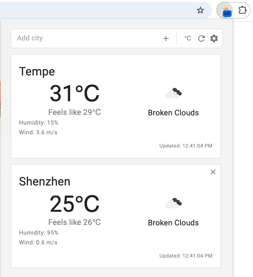

# Quick Weather View - Chrome Extension

A simple Chrome extension to quickly view current weather conditions for multiple cities, check weather via context menu, and see the temperature for a home city on the browser action badge.

 
## Features

- **Multi-City Display:** View current weather cards for multiple saved cities in the popup.
- **Add City:** Quickly add cities via the input box in the popup or by selecting text on a webpage and using the right-click context menu.
- **Check Weather:** Select any text (like a place name) on a webpage, right-click, and select "Check weather for..." to get a notification with current conditions.
- **Home City Badge:** Set a "Home City" in the options to display its current temperature directly on the extension's icon in the toolbar. Updates periodically.
- **Temperature Units:** Toggle between Celsius (°C) and Fahrenheit (°F) directly in the popup.
- **Options Page:** Configure your API key and Home City.

## Setup - IMPORTANT!

This extension requires a **free** API key from [OpenWeatherMap](https://openweathermap.org/) to function.

1.  **Sign Up/Log In:** Go to [home.openweathermap.org/users/sign_up](https://home.openweathermap.org/users/sign_up) and create a free account (or log in).
2.  **Get API Key:** Navigate to the [API keys tab](https://home.openweathermap.org/api_keys) in your OpenWeatherMap account dashboard.
3.  **Copy Key:** Copy the default API key provided (it's a 32-character string).
4.  **Enter Key in Extension:**
    - Click the Weather Extension icon in your Chrome toolbar.
    - If prompted, or by clicking the Settings (⚙️) icon, open the extension's Options page.
    - Paste the copied API key into the "OpenWeatherMap API Key" field.
    - (Optional) Set your Home City.
    - Click "Save Options".
    - _(Note: Newly generated API keys may take a few minutes to become active.)_

## Development

This project uses React, TypeScript, and Webpack.

**Getting Started:**

1.  Clone the repository (if applicable).
2.  Run `npm install` to install dependencies.
3.  Run `npm run start` to start the development build process (watches for changes and outputs to the `dist` folder).

**Loading the Extension in Chrome (Development):**

1.  Open Chrome and navigate to `chrome://extensions/`.
2.  Toggle on "Developer mode" (usually in the top right corner).
3.  Click "Load unpacked".
4.  Select the entire `dist` folder generated by the build process.

## Production Build

Run `npm run build` to generate an optimized production build in the `dist` folder.

_(Note: Your package.json build script might need adjustment - remove `--watch` for a production build)_

## Publishing (Internal Note / Or Remove for Public Readme)

1.  Increment version in `manifest.json` and `package.json`.
2.  Run `npm run build`.
3.  Create a ZIP file containing **only the contents** of the `dist` folder.
4.  Upload ZIP to Chrome Web Store Developer Dashboard.
5.  Fill out listing details, privacy policy, screenshots, etc.
6.  Submit for review.
